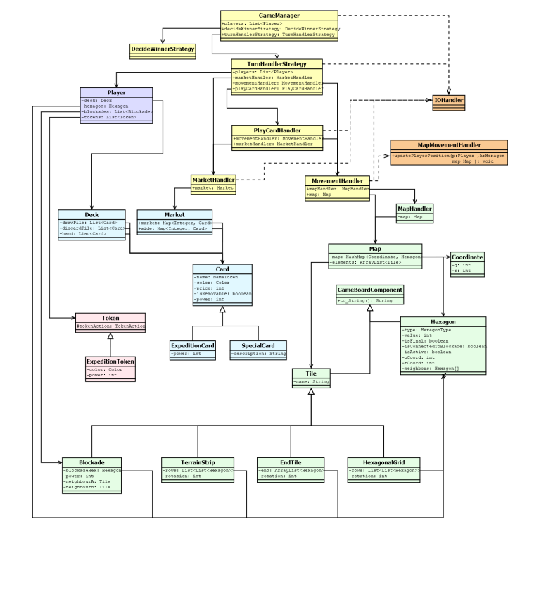
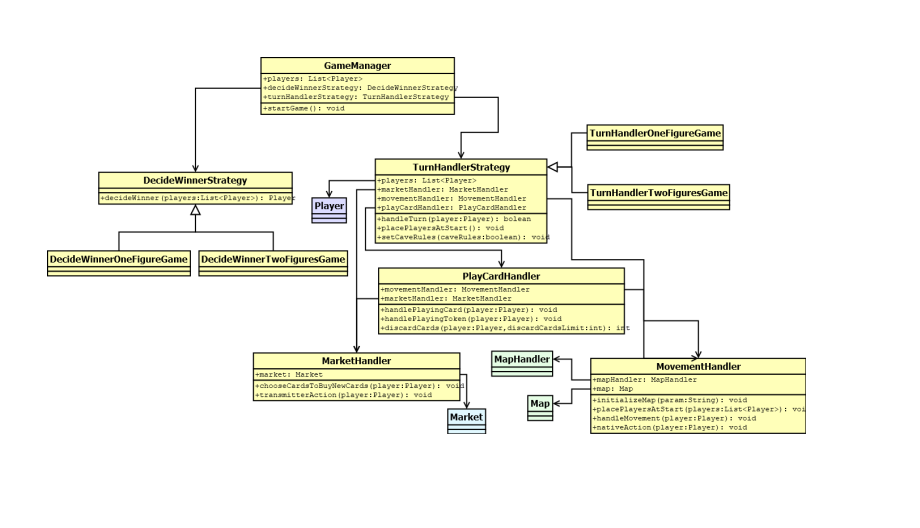
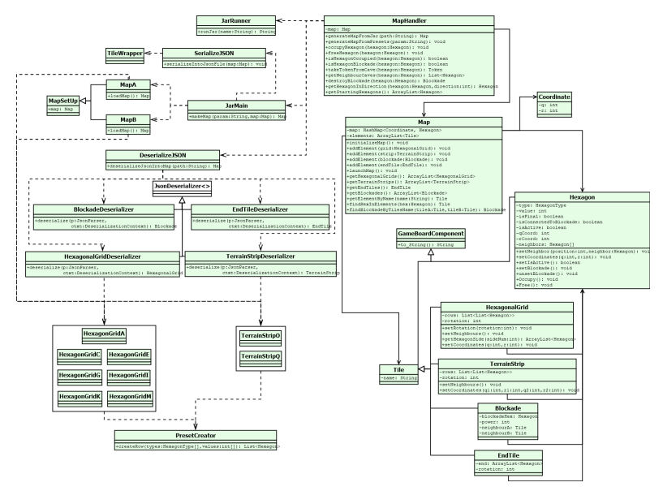
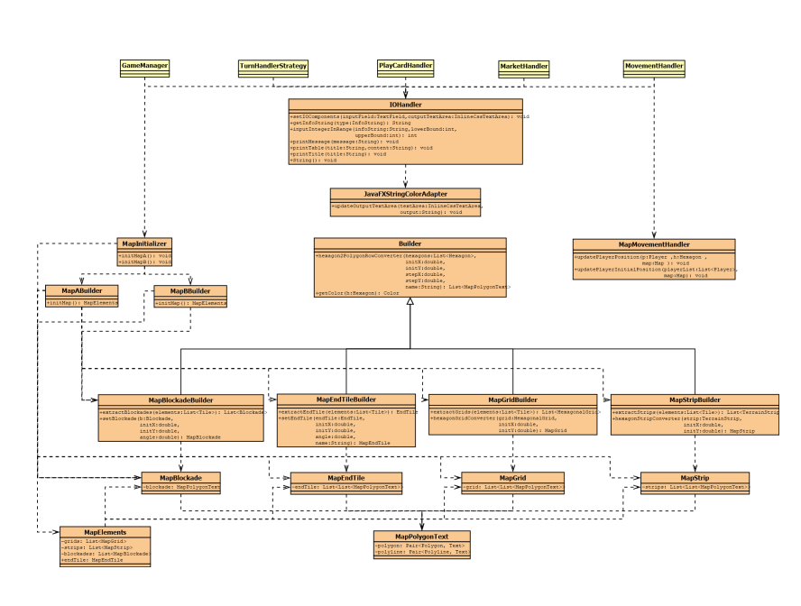
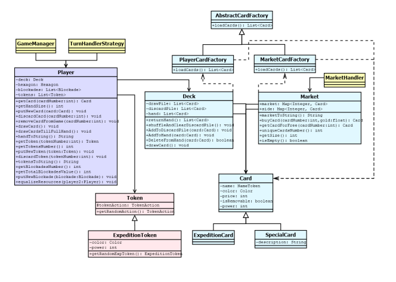

# The Quest for El Dorado — Java Game Implementation

> 📍 Course project at the University of Twente

A digital implementation of the board game **The Quest for El Dorado**, created using Java and JavaFX. The game features a hex-based map, cards, market mechanics, player movement logic, and a terminal-based UI with visual representation.

---

## 🛠️ Tech Stack

- **Java 17**
- **JavaFX** – UI rendering
- **JUnit & TestFX** – Testing
- **Jacoco** – Code coverage
- **Maven** – Build system
- **GitLab CI/CD** – Continuous integration
- **SigridCI** – Code quality & maintainability metrics
- **Jira** – Agile project management

---

## 🕹️ Gameplay Overview

- Supports **1 to 4 players**.
- Choose between **2 different maps**.
- Option to enable/disable **caves** (special gameplay mode).
- Visual game board rendered via **JavaFX**.
- Player actions are performed through **console input**.

---

## 🧱 Architecture

### Key Components

- **Board System**: `Hexagon`, `Tile`, `Map`, `MapHandler`
- **Cards & Market**: `Card`, `Deck`, `Market`
- **Player & Tokens**: `Player`, `Token`, `ExpeditionToken`
- **Game Logic**: `GameManager`, `TurnHandlerStrategy`, `MovementHandler`, `MarketHandler`
- **User Interface**: `IOHandler`, `MapMovementHandler`

### Design Patterns Used

- **Singleton** – for global `GameManager` [Code](src/main/java/components/gameManager/GameManager.java)
- **Abstract Factory** – for card creation [Code](src/main/java/components/cards)
- **Strategy** – to handle multiple gameplay rules and player turn logic [Code](src/main/java/components/gameManager/ActionHandlers/TurnHandler)

---

## ✅ Features

- 📦 **Modular Codebase** with MVC principles
- 🔁 **Agile Workflow** using 1-week sprints in **Jira**
- 🔨 **CI/CD Pipeline** with Maven, JUnit, TestFX, and **SigridCI**
- 🧪 **90%+ Test Coverage** using **Jacoco**
- 🔍 **Software Metrics** tracked (unit size, complexity, interfacing, coupling)
- 🧼 **Refactored Code**: Cleaned large classes and extracted key handlers
- 🐞 Debugged critical issues (e.g., multithreading + JavaFX UI freeze)

---

## 🧪 Testing

- **JUnit**: unit and integration tests
- **TestFX**: system/UI interaction tests
- **CI Integration**: tests run automatically on push/merge

Code for test you can see [here](src/test/java)

---

## 📊 CI/CD & Quality

- Built with **GitLab CI**
- Metrics and analysis via **SigridCI**
- Code quality improved via structured **refactoring sprints**
- Final maintainability score: **3.7**

---

## Example Diagrams
### Class Diagram (key classes)
- 
### Game controllers class diagram
- 
### Game board class diagram
- 
### Visualizers class diagram
- 
### Cards, Player and Tokens class diagram
- 

